# SQL로 만드는 나만의 데이터베이스

> **분야:** AI/SW 기초 | **구분:** 데이터베이스와 백엔드 | **학습시간:** 40시간

---

## 목차

1. [미션 소개](#1-미션-소개)
2. [개발 환경](#2-개발-환경)
3. [도메인 및 ERD](#3-도메인-및-erd)
4. [테이블 설계 (스키마)](#4-테이블-설계-스키마)
5. [제약조건 적용 내역](#5-제약조건-적용-내역)
6. [샘플 데이터](#6-샘플-데이터)
7. [핵심 쿼리 15개 + 실행 결과](#7-핵심-쿼리-15개--실행-결과)
8. [인덱스](#8-인덱스)
9. [보너스 과제](#9-보너스-과제)
10. [제출물 구성](#10-제출물-구성)
11. [과제 목표 자가 점검](#11-과제-목표-자가-점검)

---

## 1. 미션 소개

엑셀과 DB의 차이는 데이터 양이 아닌 **테이블 간 관계(Relationship)** 표현 가능 여부입니다.  
이 미션에서는 백엔드 프레임워크 없이 아래 흐름을 직접 완성합니다.

```
데이터 모델링 → 스키마 생성(DDL) → 샘플 데이터 입력(DML) → 요구사항을 SQL로 해결
```

JPA/ORM 학습 전에 관계(1:N), 키(PK/FK), 무결성, 조인 기반 조회 사고방식을 체득하는 것이 핵심 목표입니다.

---

## 2. 개발 환경

| 항목 | 내용 |
|------|------|
| DB | SQLite 3 |
| 이유 | 설치가 가장 간단하고 별도 서버 불필요, 파일 기반(.db)으로 공유가 쉬움 (입문자 추천) |
| 클라이언트 툴 | DB Browser for SQLite (GUI) |
| 실행 파일 | `shop.db` |

> SQLite 전용 문법 사용 시 해당 쿼리에 주석으로 명시했습니다.  
> 예: `PRAGMA foreign_keys = ON;` — SQLite 전용, FK 제약 활성화 설정

---

## 3. 도메인 및 ERD

**주제: 온라인 쇼핑몰**

회원이 상품을 주문하고, 주문에는 여러 상품이 담길 수 있는 구조입니다.

### ERD 다이어그램

```
MEMBER ||--o{ ORDER_       : "places"
CATEGORY ||--o{ PRODUCT    : "contains"
PRODUCT ||--o{ ORDER_ITEM  : "included in"
ORDER_ ||--o{ ORDER_ITEM   : "contains"
```

> ERD 이미지: `screenshots/erd.png`

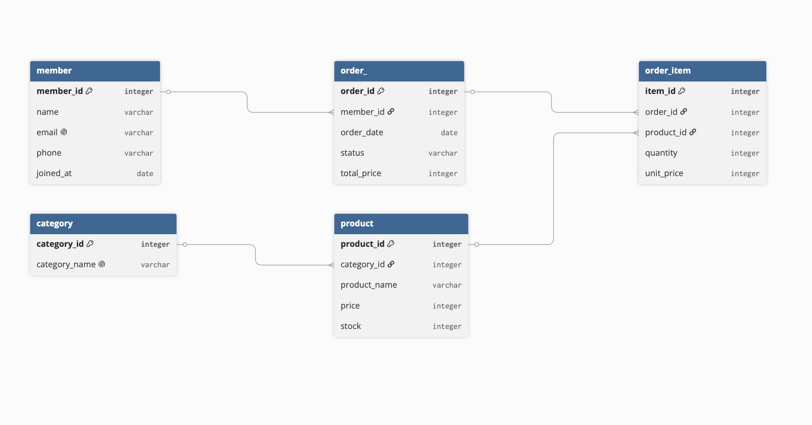

### 1:N 관계 목록 (최소 2개 이상 요구 → 4개 구현)

| 관계 | 부모 테이블 | 자식 테이블 | FK 컬럼 |
|------|------------|------------|---------|
| 1:N  | `member`   | `order_`   | `order_.member_id` |
| 1:N  | `category` | `product`  | `product.category_id` |
| 1:N  | `order_`   | `order_item` | `order_item.order_id` |
| 1:N  | `product`  | `order_item` | `order_item.product_id` |

---

## 4. 테이블 설계 (스키마)

> 파일: `01_schema.sql`

최소 4개 테이블 요구 → **5개 테이블** 구현

### `member` — 회원

| 컬럼 | 타입 | 제약조건 | 설명 |
|------|------|----------|------|
| `member_id` | INTEGER | PK, AUTOINCREMENT | 회원 고유 ID |
| `name` | VARCHAR(50) | NOT NULL | 회원 이름 |
| `email` | VARCHAR(100) | NOT NULL, UNIQUE | 이메일 (중복 불가) |
| `phone` | VARCHAR(20) | — | 전화번호 |
| `joined_at` | DATE | NOT NULL, DEFAULT(오늘) | 가입일 |

### `category` — 카테고리

| 컬럼 | 타입 | 제약조건 | 설명 |
|------|------|----------|------|
| `category_id` | INTEGER | PK, AUTOINCREMENT | 카테고리 ID |
| `category_name` | VARCHAR(50) | NOT NULL, UNIQUE | 카테고리 이름 |

### `product` — 상품

| 컬럼 | 타입 | 제약조건 | 설명 |
|------|------|----------|------|
| `product_id` | INTEGER | PK, AUTOINCREMENT | 상품 ID |
| `category_id` | INTEGER | NOT NULL, FK | 카테고리 참조 |
| `product_name` | VARCHAR(100) | NOT NULL | 상품명 |
| `price` | INTEGER | NOT NULL, CHECK(≥0) | 판매가 |
| `stock` | INTEGER | NOT NULL, DEFAULT 0, CHECK(≥0) | 재고 수량 |

### `order_` — 주문

| 컬럼 | 타입 | 제약조건 | 설명 |
|------|------|----------|------|
| `order_id` | INTEGER | PK, AUTOINCREMENT | 주문 ID |
| `member_id` | INTEGER | NOT NULL, FK | 회원 참조 |
| `order_date` | DATE | NOT NULL, DEFAULT(오늘) | 주문일 |
| `status` | VARCHAR(20) | NOT NULL, DEFAULT 'pending' | 주문 상태 (pending/paid/shipped/cancelled) |
| `total_price` | INTEGER | NOT NULL, DEFAULT 0 | 총 결제금액 |

### `order_item` — 주문상세

| 컬럼 | 타입 | 제약조건 | 설명 |
|------|------|----------|------|
| `item_id` | INTEGER | PK, AUTOINCREMENT | 주문상세 ID |
| `order_id` | INTEGER | NOT NULL, FK | 주문 참조 |
| `product_id` | INTEGER | NOT NULL, FK | 상품 참조 |
| `quantity` | INTEGER | NOT NULL, CHECK(>0) | 수량 |
| `unit_price` | INTEGER | NOT NULL | 주문 시점 단가 (가격 변동 대비 스냅샷) |

---

## 5. 제약조건 적용 내역

| 제약조건 | 적용 컬럼 | 내용 |
|----------|-----------|------|
| `NOT NULL` | `member.name`, `product.product_name` 외 다수 | 필수 입력값 보장 |
| `UNIQUE` | `member.email`, `category.category_name` | 중복 방지 |
| `FOREIGN KEY` | `order_.member_id` → `member.member_id` 외 3개 | 참조 무결성 보장 |
| `CHECK` | `product.price >= 0`, `product.stock >= 0`, `order_item.quantity > 0` | 유효 범위 보장 |
| `DEFAULT` | `joined_at`, `order_date`, `status`, `stock`, `total_price` | 기본값 자동 설정 |

> FK 제약조건은 `PRAGMA foreign_keys = ON;` 으로 활성화합니다 (SQLite 전용).  
> 존재하지 않는 `member_id`로 `order_` 삽입 시 오류 발생하여 무결성이 보장됩니다.

---

## 6. 샘플 데이터

> 파일: `02_data.sql`  
> 각 테이블 최소 10행 이상 / FK 연결 데이터 실제 관계 유지

| 테이블 | 행 수 | 주요 내용 |
|--------|-------|-----------|
| `member` | 10행 | 회원 10명, 이메일·가입일 포함 |
| `category` | 5행 | 전자기기, 패션, 식품, 도서, 스포츠 |
| `product` | 15행 | 카테고리별 3개 상품, 가격·재고 포함 |
| `order_` | 12행 | 다양한 상태(paid/shipped/cancelled/pending) |
| `order_item` | 20행 | 주문별 1~3개 상품 상세, 주문 시점 단가 저장 |

> **입력 순서 준수:** `member` → `category` → `product` → `order_` → `order_item`  
> (FK 참조 대상인 부모 테이블이 반드시 먼저 존재해야 함)

---

## 7. 핵심 쿼리 15개 + 실행 결과

> 파일: `03_queries.sql` | 실행 결과: `04_query_results.txt` 또는 `screenshots/` 폴더

### [기본 조회] 4개

---

**Q1. 재고 50개 이상 상품 — 가격 내림차순 조회**  
`WHERE` + `ORDER BY` 기본 사용

```sql
SELECT product_id, product_name, price, stock
FROM product
WHERE stock >= 50
ORDER BY price DESC;
```

> 실행 결과: `screenshots/q01.png`

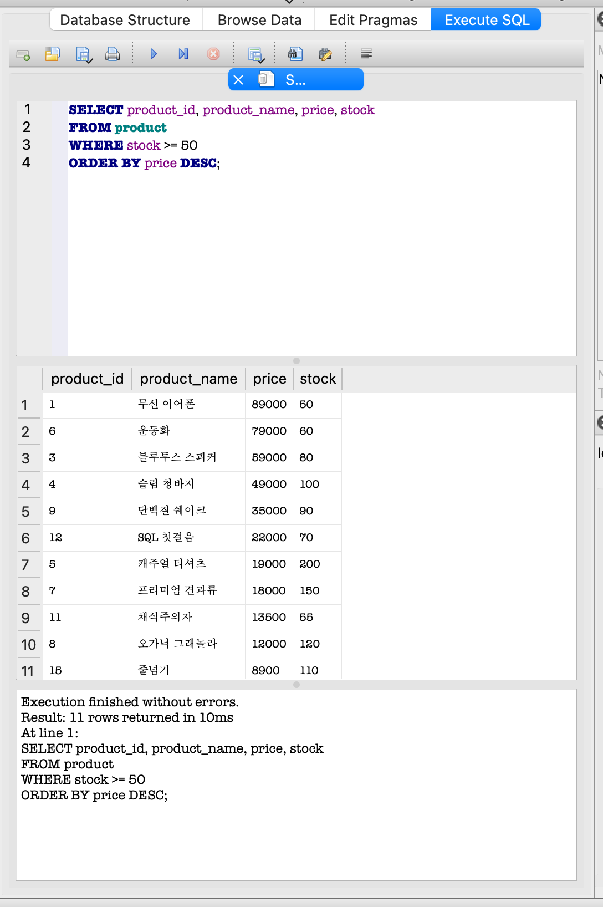

---

**Q2. 가장 최근에 가입한 회원 5명**  
`ORDER BY` + `LIMIT` 사용

```sql
SELECT member_id, name, email, joined_at
FROM member
ORDER BY joined_at DESC
LIMIT 5;
```

> 실행 결과: `screenshots/q02.png`

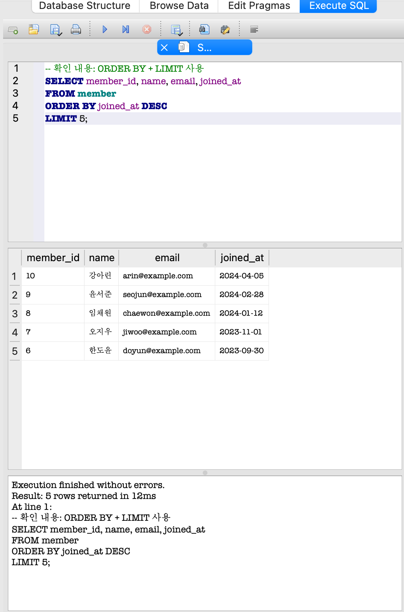

---

**Q3. `shipped` 상태 주문 목록 — 최신순**  
`WHERE` + `ORDER BY` 조합

```sql
SELECT order_id, member_id, order_date, status, total_price
FROM order_
WHERE status = 'shipped'
ORDER BY order_date DESC;
```

> 실행 결과: `screenshots/q03.png`

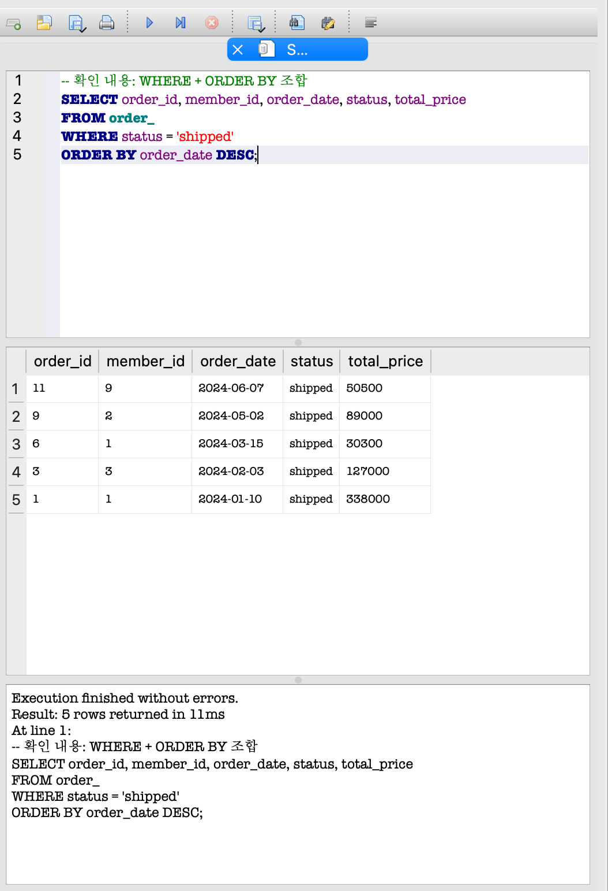

---

**Q4. 상품명에 '세트' 또는 '프리미엄' 포함 상품 검색**  
`LIKE` 패턴 매칭

```sql
SELECT product_id, product_name, price, stock
FROM product
WHERE product_name LIKE '%세트%'
   OR product_name LIKE '%프리미엄%';
```

> 실행 결과: `screenshots/q04.png`

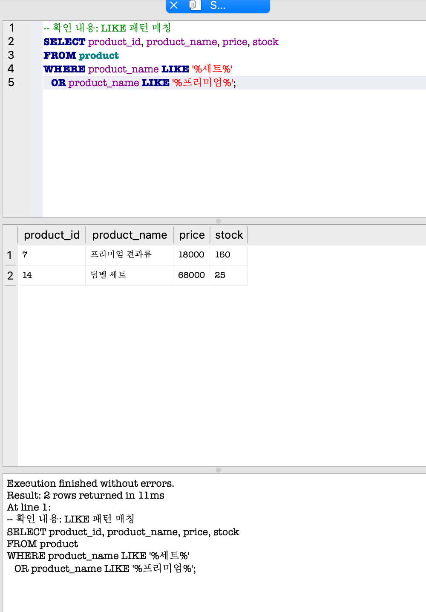

---

### [조인] 4개

---

**Q5. 모든 주문에 회원 이름 붙이기 — INNER JOIN**  
`order_` ↔ `member` 조인

```sql
SELECT o.order_id,
       m.name     AS 회원명,
       o.order_date,
       o.status,
       o.total_price
FROM order_ o
INNER JOIN member m ON o.member_id = m.member_id
ORDER BY o.order_date;
```

> 실행 결과: `screenshots/q05.png`

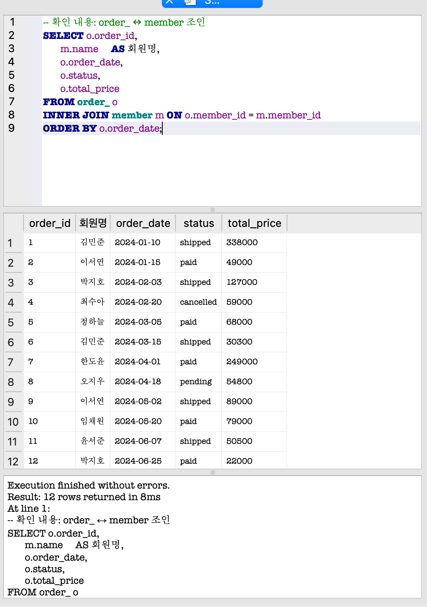

---

**Q6. 주문상세에 상품명·카테고리 함께 조회 — 3테이블 INNER JOIN**  
`order_item` ↔ `product` ↔ `category`

```sql
SELECT oi.item_id,
       oi.order_id,
       p.product_name  AS 상품명,
       c.category_name AS 카테고리,
       oi.quantity,
       oi.unit_price,
       (oi.quantity * oi.unit_price) AS 소계
FROM order_item oi
INNER JOIN product  p ON oi.product_id = p.product_id
INNER JOIN category c ON p.category_id = c.category_id
ORDER BY oi.order_id;
```

> 실행 결과: `screenshots/q06.png`

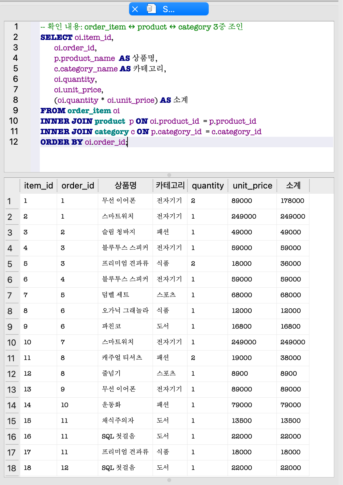

---

**Q7. 한 번도 주문하지 않은 회원 조회 — LEFT JOIN**  
`LEFT JOIN` + `IS NULL` 패턴으로 미주문 회원 추출

```sql
SELECT m.member_id,
       m.name,
       m.email,
       m.joined_at
FROM member m
LEFT JOIN order_ o ON m.member_id = o.member_id
WHERE o.order_id IS NULL;
```

> 실행 결과: `screenshots/q07.png`

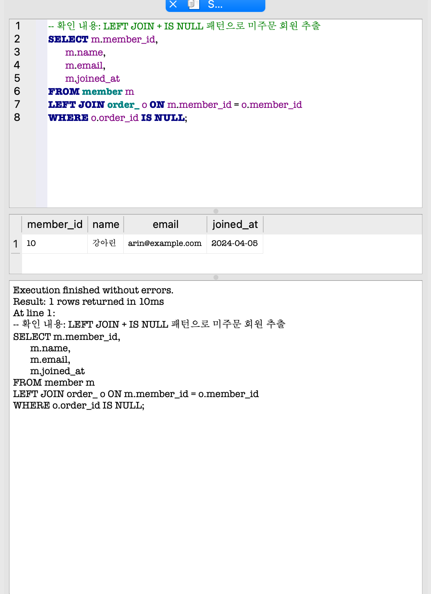

---

**Q8. 카테고리별 상품 목록 — INNER JOIN + 복합 정렬**  
`category` ↔ `product` 조인

```sql
SELECT c.category_name AS 카테고리,
       p.product_name  AS 상품명,
       p.price,
       p.stock
FROM product p
INNER JOIN category c ON p.category_id = c.category_id
ORDER BY c.category_name, p.price DESC;
```

> 실행 결과: `screenshots/q08.png`

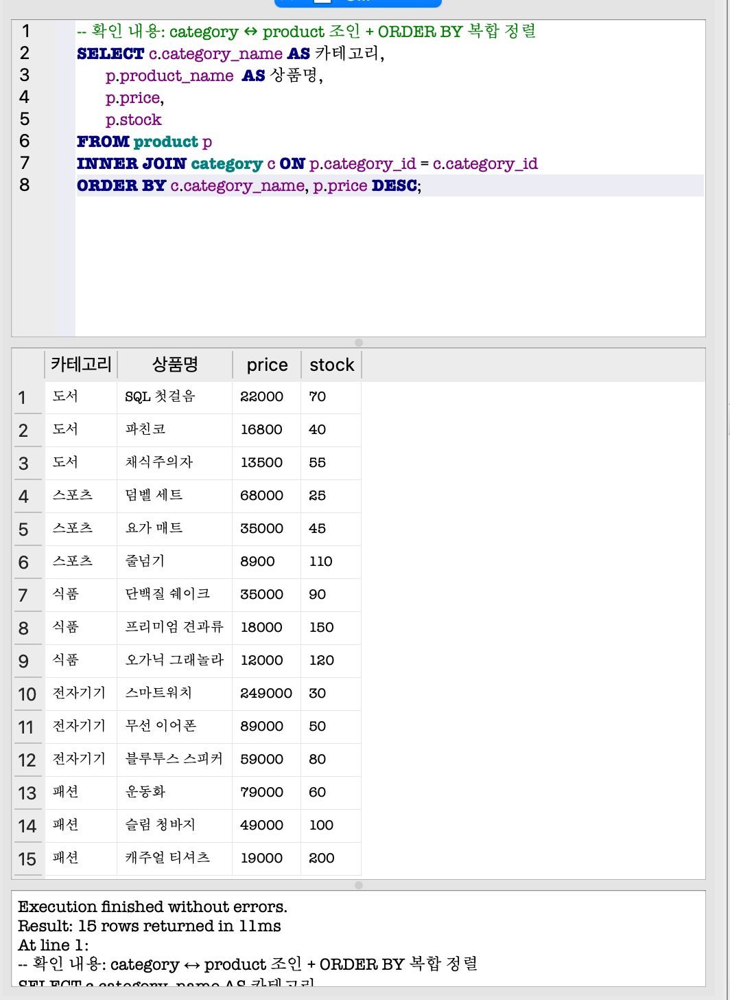

---

### [집계] 3개

---

**Q9. 회원별 총 주문 횟수와 총 결제 금액**  
`COUNT` + `SUM` + `GROUP BY`

```sql
SELECT m.name             AS 회원명,
       COUNT(o.order_id)  AS 주문횟수,
       SUM(o.total_price) AS 총결제금액
FROM member m
INNER JOIN order_ o ON m.member_id = o.member_id
GROUP BY m.member_id, m.name
ORDER BY 총결제금액 DESC;
```

> 실행 결과: `screenshots/q09.png`

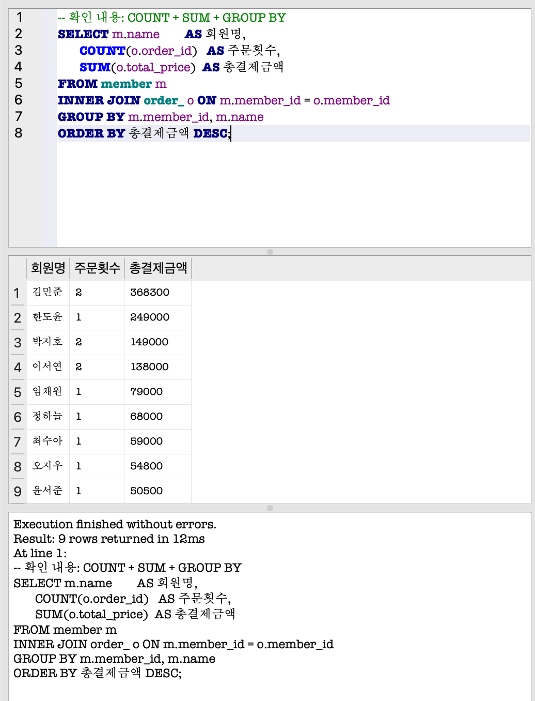

---

**Q10. 카테고리별 평균 상품 가격과 상품 수**  
`AVG` + `COUNT` + `GROUP BY`

```sql
SELECT c.category_name       AS 카테고리,
       COUNT(p.product_id)   AS 상품수,
       ROUND(AVG(p.price),0) AS 평균가격
FROM category c
INNER JOIN product p ON c.category_id = p.category_id
GROUP BY c.category_id, c.category_name
ORDER BY 평균가격 DESC;
```

> 실행 결과: `screenshots/q10.png`

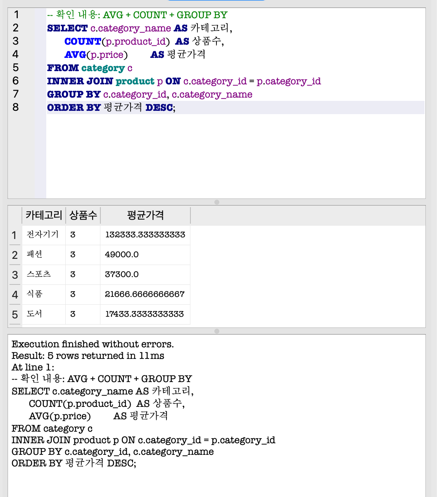

---

**Q11. 2건 이상 주문된 상품만 조회 — HAVING**  
`GROUP BY` + `HAVING`으로 집계 결과 필터링

```sql
SELECT p.product_name              AS 상품명,
       SUM(oi.quantity)            AS 총판매수량,
       COUNT(DISTINCT oi.order_id) AS 주문건수
FROM order_item oi
INNER JOIN product p ON oi.product_id = p.product_id
GROUP BY oi.product_id, p.product_name
HAVING 주문건수 >= 2
ORDER BY 총판매수량 DESC;
```

> 실행 결과: `screenshots/q11.png`

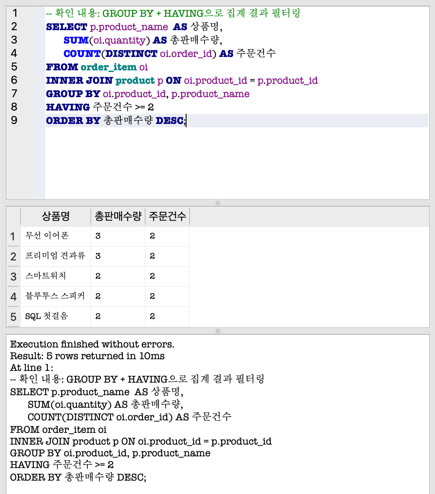

---

### [서브쿼리] 2개

---

**Q12. 전체 평균 가격보다 비싼 상품 조회**  
`WHERE` 절 스칼라 서브쿼리

```sql
SELECT product_id, product_name, price
FROM product
WHERE price > (SELECT AVG(price) FROM product)
ORDER BY price DESC;
```

> 실행 결과: `screenshots/q12.png`

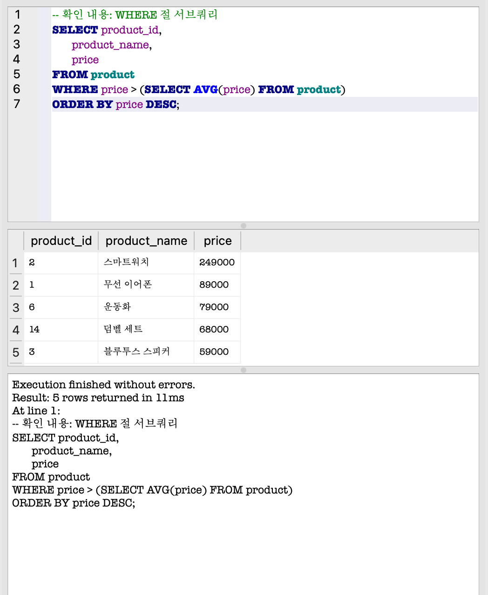

---

**Q13. 한 번도 주문되지 않은 상품 조회**  
`NOT IN` 서브쿼리

```sql
SELECT product_id, product_name, price
FROM product
WHERE product_id NOT IN (
    SELECT DISTINCT product_id FROM order_item
);
```

> 실행 결과: `screenshots/q13.png`

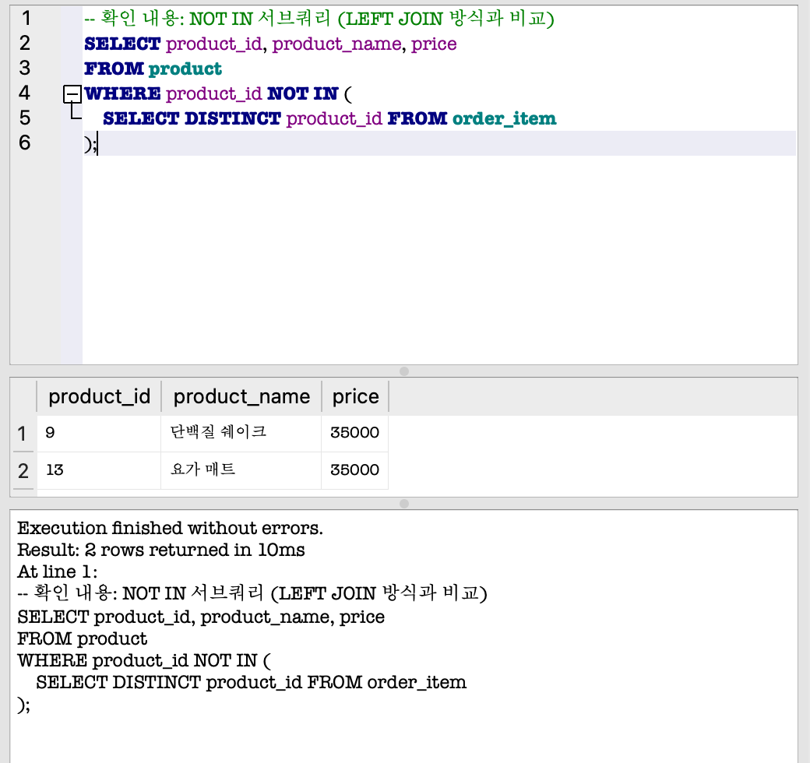

---

### [수정 및 삭제] 2개

---

**Q14. 취소 주문의 상품 재고 원복 — UPDATE**  
서브쿼리를 활용한 조건부 수정

```sql
UPDATE product
SET stock = stock + 1
WHERE product_id = (
    SELECT oi.product_id
    FROM order_item oi
    INNER JOIN order_ o ON oi.order_id = o.order_id
    WHERE o.order_id = 4 AND o.status = 'cancelled'
    LIMIT 1
);

-- 결과 확인: 블루투스 스피커 재고 80 → 81
SELECT product_id, product_name, stock
FROM product WHERE product_id = 3;
```

> 실행 결과: `screenshots/q14.png`

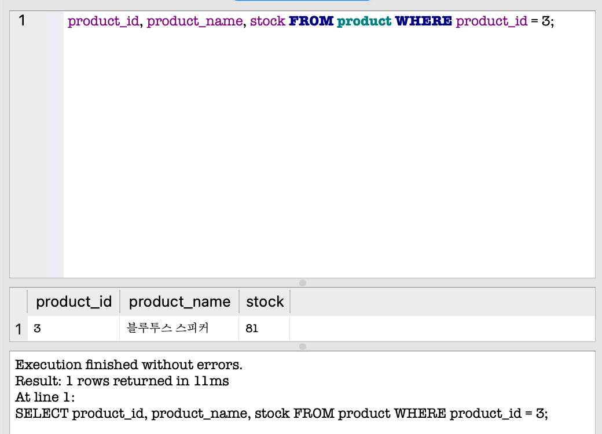

---

**Q15. pending 주문 상태 변경 + 오래된 취소 주문 삭제 — UPDATE & DELETE**  
FK 오류 방지를 위해 자식 테이블(`order_item`)을 먼저 삭제 후 부모(`order_`) 삭제

```sql
-- pending → paid 상태 변경
UPDATE order_
SET status = 'paid'
WHERE status = 'pending';

-- 자식 테이블 먼저 삭제
DELETE FROM order_item
WHERE order_id IN (
    SELECT order_id FROM order_
    WHERE status = 'cancelled' AND order_date < '2024-02-01'
);

-- 부모 테이블 삭제
DELETE FROM order_
WHERE status = 'cancelled' AND order_date < '2024-02-01';

-- 결과 확인
SELECT order_id, status, order_date FROM order_;
```

> 실행 결과: `screenshots/q15.png`

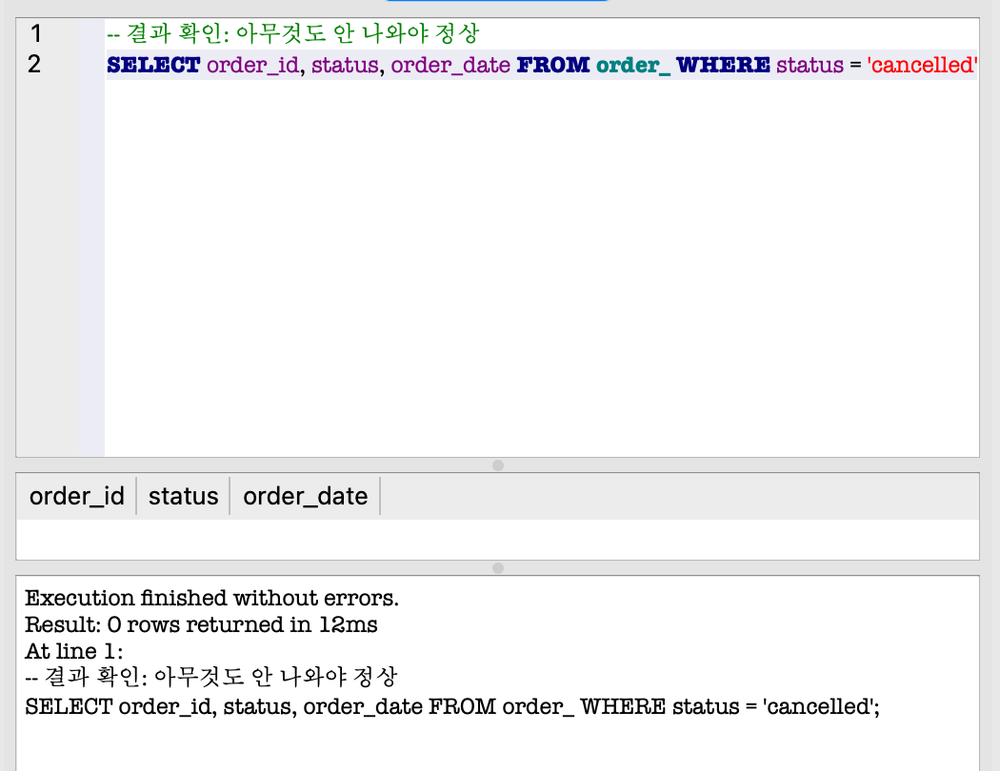

---

## 8. 인덱스

> 파일: `01_schema.sql` 하단에 포함

```sql
-- 인덱스 1: 주문 테이블에서 member_id 기반 조회가 잦으므로 조회 속도 개선
CREATE INDEX idx_order_member ON order_(member_id);

-- 인덱스 2: 상품 조회 시 카테고리 필터링이 자주 발생하므로 인덱스 추가
CREATE INDEX idx_product_category ON product(category_id);
```

**적용 이유:**  
`order_` 테이블은 회원별 주문 내역 조회(Q5, Q9 등)가 빈번하게 발생합니다.  
`member_id` 컬럼에 인덱스를 생성하면 전체 테이블 스캔(Full Scan) 대신 인덱스를 통한 빠른 조회가 가능합니다.  
마찬가지로 `product` 테이블에서 카테고리 필터링(Q8, Q10 등)이 잦으므로 `category_id`에도 인덱스를 적용했습니다.

---

## 10. 제출물 구성

```
📁 프로젝트 루트
├── 📄 README.md                ← 본 파일
├── 📄 01_schema.sql            ← 스키마 생성 SQL (DDL)
├── 📄 02_data.sql              ← 샘플 데이터 INSERT SQL
├── 📄 03_queries.sql           ← 핵심 쿼리 15개
├── 📄 04_query_results.txt     ← 쿼리 실행 결과 텍스트
└── 📁 screenshots/
    ├── erd.png                 ← ERD 다이어그램
    ├── q01.png ~ q15.png       ← 쿼리 1~15 실행 결과 캡처
```

---

## 11. 과제 목표 자가 점검

| 목표 | 확인 |
|------|------|
| DB가 엑셀과 뭐가 다른지, 왜 테이블로 나눠 저장하는지 설명할 수 있다 | ✅ |
| PK/FK가 무엇이고 1:N 관계가 데이터를 어떻게 연결하는지 말로 설명할 수 있다 | ✅ |
| `SELECT` / `INSERT` / `UPDATE` / `DELETE`를 언제 쓰는지 구분할 수 있다 | ✅ |
| `JOIN`과 `GROUP BY`로 연결된 데이터를 한 번에 뽑는 방법을 설명할 수 있다 | ✅ |
| 실무에서 흔한 요구(검색/정렬/집계/랭킹)를 SQL로 어떻게 풀지 감을 잡을 수 있다 | ✅ |
| 인덱스가 왜 필요한지, 어떤 컬럼에 적용하면 좋은지 기초적인 이해를 할 수 있다 | ✅ |

---

### 제약사항 준수 확인

| 제약사항 | 준수 여부 |
|----------|-----------|
| 백엔드 프레임워크(Spring/Django/Express 등) 사용 금지 | ✅ 순수 SQL만 사용 |
| 뷰(View), 프로시저, 트리거 등 고급 기능 미사용 | ✅ |
| 로컬에서 실행 가능한 DB 사용 | ✅ SQLite (로컬 파일 기반) |
| 정규화 이론 과도 적용 없이 자연스러운 관계 구조 유지 | ✅ |